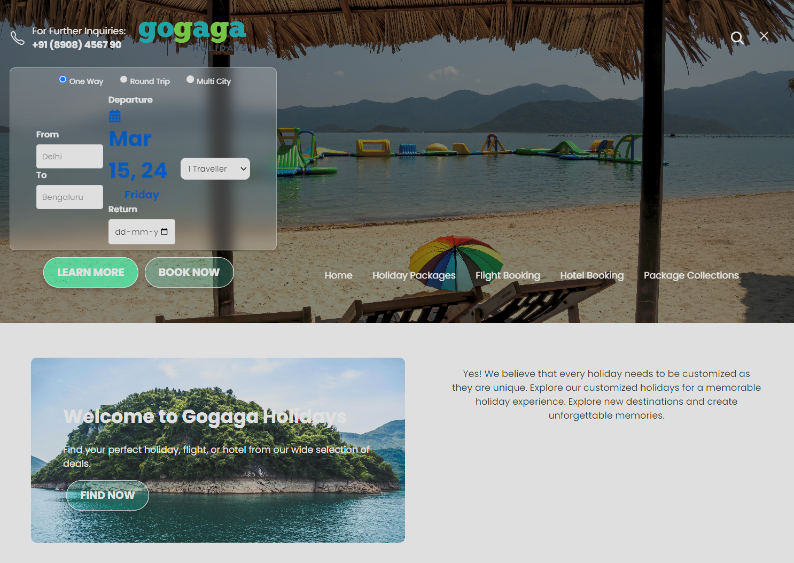
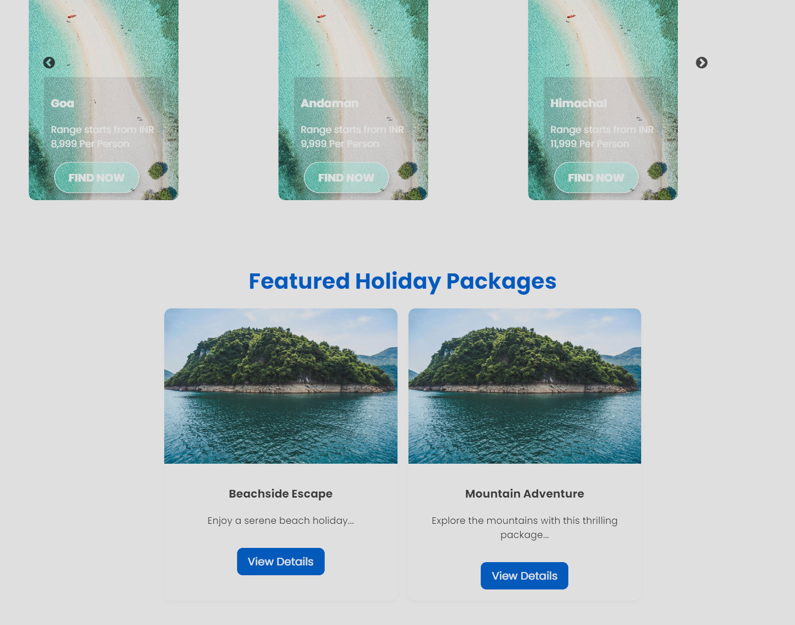

# Gogaga Holidays Website

Welcome to the repository of the Gogaga Holidays website, a responsive web platform designed to provide users with a seamless experience in planning and booking their holidays.

## Features

- **Holiday Packages**: Users can browse through a variety of holiday packages, each detailed with itineraries, pricing, and features.
- **Flight Booking**: An integrated flight search and booking tool allows users to find flights based on their destination and dates.
- **Hotel Booking**: Our hotel booking feature provides users with the ability to search for hotels and book accommodations that suit their preferences.
- **Package Collections**: Curated travel package collections are showcased, giving users quick access to themed holiday experiences.


## Images/Screenshots


## Technologies

- HTML
- CSS
- React.js
- Slick Carousel for React
- Google Fonts

## Responsive Design

The website is fully responsive and caters to devices of various screen sizes, ensuring a user-friendly experience on desktops, tablets, and smartphones.

## Setup and Installation

To get a local copy up and running, follow these simple steps:

1. Clone the repository to your local machine:

```bash
git clone https://github.com/your-username/gogaga-holidays.git
